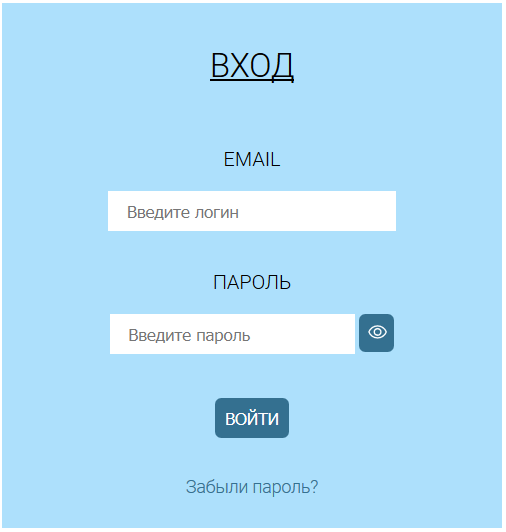
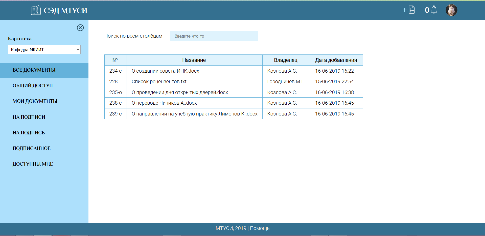
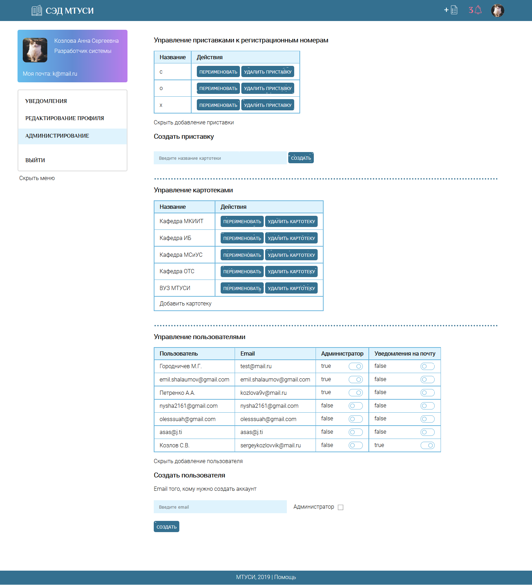
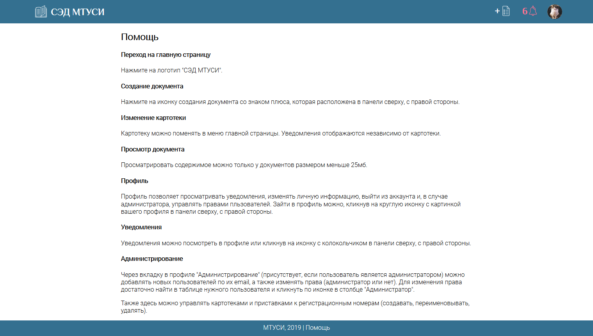

1ая версия диплома (защищено на 5). Вторая версия (в разработке) - [edsm-v2](https://github.com/Spanri/edsm-v2)

# СЭД МТУСИ :sweat_drops:

Система электронного документооборота, в которой админ регает пользователей, а пользователи создают документы, подписывают их и просят других пользователей подписать их документы.
Подпись по цепочке на базе блокчейна (алгоритм подписи делал не автор, а другой разработчик, подсказка - он есть в авторах этого проекта).

Vue.js / Django (rest framework)

## Развернуть проект

Для работы используется `Docker` - "программа", в которой я прописываю все настройки фронтенда, бекенда и т.д., а разработчику остается лишь запустить "программу" `Docker` и всё запустится у него на компьютере.

Проблема: я пробовала это лишь на ОС `ubuntu 20`, не знаю, что в `windows` и `macOS`.

1. Установить `Docker`.
Можно в инете погуглить, как это сделать. Я на `ubuntu 20` скачала через программу `synaptic`: выбрала `docker`, `docker-compose` и все пакеты, которые предложило дополнительно установить.

2. Запустить `Docker`
Можно по-разному, но я делаю это так:

```bash
edsm-v1$ cd docker
docker$ docker-compose down
docker$ docker-compose up
```

Здесь `docker-compose down` - удалить все предыдущие запущенные контейнеры.
`docker-compose up` - запустить текущие контейнеры.
Выйти из консоли - `Crtl+C` (2 раза). При этом контейнеры всё ещё будут запущены в фоне. Они, возможно, тратят ресурсы вашего компьютера, поэтому их можно "удалить", если они больше не нужны - `docker-compose down`.

3. Посмотреть нужный контейнер в браузере
Фронтенд, для разработки - `http://localhost:8080`
Фронтенд, просто посмотреть - `http://localhost:8081`

Бэкенда в докере нет (мне лень было), поэтому его надо отдельно устанавливать.

### Бекенд

* Скачиваем проект
* Скачиваем питон 3.7
* Скачиваем virtualenv (я просто в synaptic скачала рандомный virtualenv)
* Для пакета psycopg2 нужны эти штуки, скачиваем их
  sudo apt-get install python3.7-dev
  sudo apt-get install -y libpq-dev
* Создаем venv, у меня так создается (в корне проекта):

  ``` bash
  virtualenv --python=/usr/bin/python3.7 venv
  ```

  Указываем версию питона, чтобы точно она заюзалась, а то вдруг у вас еще какие-то версии питона есть, случайно не та может заюзаться при создании, если жестко ее не прописывать в команде выше.

## Интерфейс

Интерфейс в виде скринов показан в самом низу, чтобы не мешаться тут.

## Построение

### Бекенд, Django

Не забудьте установить python!

``` bash
# установить зависимости
pip3 install -r requirements.txt

# собрать статические файлы, для того, чтобы
# запустить клиент на сервере
python manage.py collectstatic

# миграция таблиц для правильной работы с бд
python manage.py migrate

# Нужно настроить глобальные переменные (для почты, для бд, для
# хранилища амазона и так далее). Все значения секретные, поэтому
# нужно писать разработчику, если он даст - сможете протестировать.
# Ниже пример настройки глобальной переменной. Это для виндовс,
# для юниксов вместо set - export
set EDMS-MAIL-PASSWORD=password

# запустить
python manage.py runserver

# зайти в администратора (данные суперюзера или админа, который есть в
# бд (то есть если если известен аккаунт на edms-mtuci.herokuapp.com и
# он админский) или суперюзера). Первая строка - создание суперюзера
# (если нет админского аккаунта)
python manage.py createsuperuser
http://localhost:8000/api/admin/login/?next=/api/admin/

# зайти в приложение, которое фронтенд
http://localhost:8000
```

## Статусы связи документа и пользователя

Есть таблица Notif, она связывает документ и пользователя. Отношение связи показывает поле status

| Status | Что значит  
| --- |:---:|
| 0 | Владелец
| 1 | Не владелец, нужна подпись, очередь еще не подошла
| 2 | Не владелец, нужна подпись, очередь подошла
| 3 | Подпись есть, владелец подписанного документа видит уведомление
| 4 | Подпись есть, владелец подписанного документа НЕ видит уведомление
| 5 | Не владелец, подпись не нужна, может только смотреть документ
| 6 | В таблице нет, ставится при возвращении документов для конкретного пользователя тем документам, которые были подписаны этим пользователем (чтобы отличить от документов, которые принадлежат пользователю и находятся в уведомлениях "Ваш документ подписали.")
| 7 | Подписант отказался подписывать

## Другие штуки

[Документация на сервер](https://edms-mtuci.herokuapp.com/api/docsServer/)

[Веб-приложение](https://edms-mtuci.herokuapp.com/app)
Логин: kozlova9v@mail.ru
Пароль: password123

[Панель администратора](https://edms-mtuci.herokuapp.com/api/admin/) (данные администратора спросить у разработчика, но он может и не дать их)

### Интерфейс, вход

Вход (регистрацию делает админ)<br>


### Интерфейс, главная

Главная, все документы<br>


Главная, общий доступ (остальные вкладки похожи на "все документы")<br>


### Интерфейс, документ

Добавление документа<br>


Документ владельца<br>


Документ не владельца (виден ему, ибо он должен его подписать)<br>


Подписант отказался подписывать и вот это увидел владелец документа<br>


Редактирование документа<br>


### Интерфейс, письма

Запрос подписи, письмо на почте<br>


Регистрация, письмо на почте<br>


Сброс пароля, письмо на почте<br>


### Интерфейс, профиль

Профиль с уведомлениями (фиолетовое - не прочитано)<br>


Редактирование профиля<br>


Администрирование<br>


### Интерфейс, другое

Смена пароля 1<br>


Смена пароля 2<br>


Помощь (открывается по ссылке в футере)<br>


<p style="text-align: center;margin:0;margin-top:35px;">Сделала Аня, 2019 - 2022</p>
